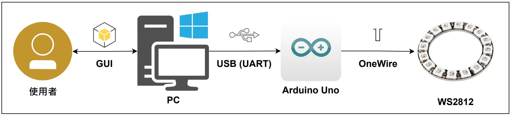

# WS2812 Light Controller


# Hardware
- Arduino Uno Rev.3 / Any Arduino Compatible Board.
[](https://store.arduino.cc/products/arduino-uno-rev3)
- WS2812 Light Strip / Ring.
[](https://www.dfrobot.com/product-2541.html)

# Build
## Firmware
1. Install [Ardiuno IDE](https://www.arduino.cc/en/software). (*Use 1.x / 2.x Are the Same*)
2. Install Boards Package Depends On Your Development Board.
3. Install FastLED Libraries.
4. Choose Your Board And Com Port.
5. Click Verify And Upload.

## Software
1. Install Python 3.10.x Environment or Later. (*Also Can Use Anaconda / Miniconda Environment.*)
    - [Python Minimal Enviroment](https://www.python.org/downloads/)
    - [Anaconda Environemnt](https://www.anaconda.com/download/)
    - [Miniconda Environment](https://conda.io/miniconda.html)
2. Install Requirements From `Software/` Folder.
3. Go To `Software/ws2812`, then Type This Command From Terminal / Powershell:
```bash
python src/main.py
```
4. Enjoy!

# System Structure
